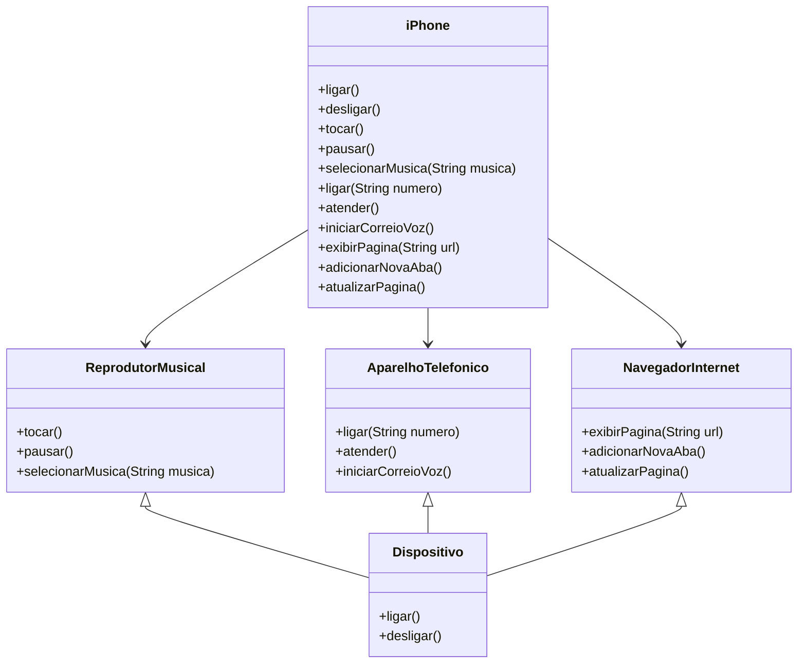

# [DIO](www.dio.me) - Trilha Java Básico

## Autores
- [Gabriel (https://github.com/gabrielduo)

## POO - Desafio

### Diagrama UML (Mermaid)

```mermaid
classDiagram
    class Dispositivo {
        +ligar()
        +desligar()
    }

    class ReprodutorMusical {
        +tocar()
        +pausar()
        +selecionarMusica(String musica)
    }

    class AparelhoTelefonico {
        +ligar(String numero)
        +atender()
        +iniciarCorreioVoz()
    }

    class NavegadorInternet {
        +exibirPagina(String url)
        +adicionarNovaAba()
        +atualizarPagina()
    }

    class iPhone {
        +ligar()
        +desligar()
        +tocar()
        +pausar()
        +selecionarMusica(String musica)
        +ligar(String numero)
        +atender()
        +iniciarCorreioVoz()
        +exibirPagina(String url)
        +adicionarNovaAba()
        +atualizarPagina()
    }

    ReprodutorMusical <|-- Dispositivo
    AparelhoTelefonico <|-- Dispositivo
    NavegadorInternet <|-- Dispositivo
    iPhone --> ReprodutorMusical
    iPhone --> AparelhoTelefonico
    iPhone --> NavegadorInternet
```
